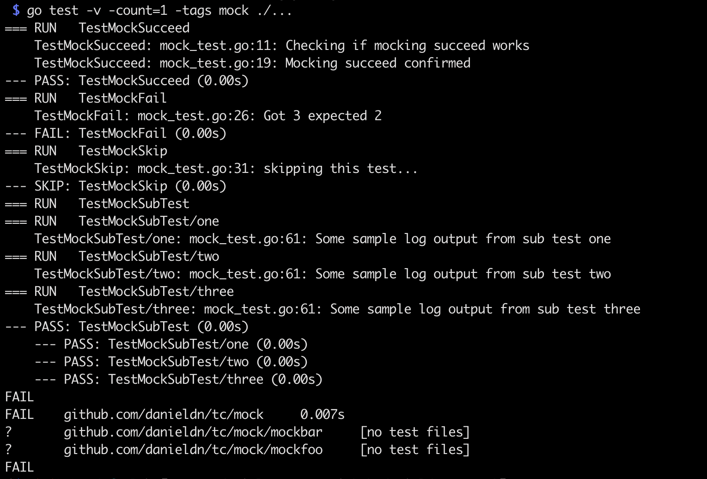
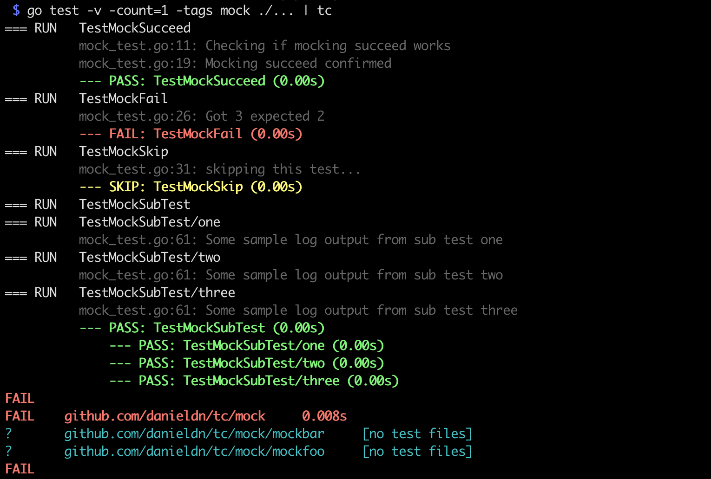

# testcolor
[](https://travis-ci.org/danieldn/tc) [](https://goreportcard.com/report/github.com/danieldn/tc) [](https://coveralls.io/github/danieldn/tc?branch=master)

tc pretty prints your 'go test' output 

Before:



After:



Install using


```bash
go get github.com/danieldn/tc
```

Then pipe your `go test` output

```bash
go test -v ./... | tc 
```

Disable features you don't want with flags
```bash
Usage:
	go test -v ./... | tc [flags]

Optional flags:
  -nocolor
    	Disables color (default false)
  -nofmt
    	Disables formatting (default false)
```

## How It Works

This tool was made just using the standard Go library. It parses input to a
buffer and performs a pattern search to insert ANSI color escape codes and text
formatting where we want. 

## Performance

This tool relies on Go's [bytes.Buffer](https://golang.org/src/bytes/buffer.go)
to minimize memory allocation when reading and editing text input. 

## Inspired By

* https://github.com/rakyll/gotest
* https://github.com/fatih/color
* https://github.com/logrusorgru/aurora
* https://github.com/mitchellh/colorstring
